# Container Onboarding Workflow - Detailed Documentation

## Overview

This document provides a comprehensive explanation of the container onboarding workflow with race condition handling and dual-check approval system.

## Workflow Diagram

```mermaid
graph TB
    Start([User creates Issue]) --> IssueTemplate[Issue Template<br/>with Default Values]
    IssueTemplate --> |CPU: 4 cores<br/>Memory: 8Gi<br/>Storage: 50Gi| IssueCreated[Issue Created]

    IssueCreated --> |status:ibe-approval label<br/>automatically added| WaitApproval[Waiting for Approver]

    WaitApproval --> |Approver comments<br/>/onboard-container| Trigger[Workflow Triggered]

    Trigger --> MutexCheck{Check Mutex Label<br/>status:ibe-processing}

    MutexCheck --> |Label exists| RaceDetected[Race Condition Detected!]
    RaceDetected --> ExitEarly[Exit Early<br/>Post warning comment]

    MutexCheck --> |Label not present| AcquireMutex[Add status:ibe-processing<br/>Acquire Mutex Lock]

    AcquireMutex --> GenCorrelation[Generate Correlation ID<br/>timestamp-PID-random]

    GenCorrelation --> ValidateApprover{Validate Approver<br/>from ibe_approvers.md}

    ValidateApprover --> |Not authorized| RejectApprover[Post rejection comment<br/>Exit workflow]

    ValidateApprover --> |Authorized| ParseFields[Parse Issue Fields<br/>namespace, cpu, memory,<br/>storage, environment]

    ParseFields --> FetchConfig[Fetch Configuration<br/>Rhapsody version,<br/>Cluster mapping,<br/>Bucket name]

    FetchConfig --> Check1{Check 1:<br/>Namespace Availability}

    Check1 --> |Not found| Check1Fail[Post error comment<br/>Namespace not found<br/>in IBE_EKS/Argocd/]
    Check1Fail --> RemoveMutex1[Remove Mutex Label]
    RemoveMutex1 --> EndFail1([Workflow Ends])

    Check1 --> |Exists in IBE_EKS| Check2{Check 2:<br/>Routing Configuration}

    Check2 --> |Not found| Check2Fail[Post error comment<br/>Routing config missing<br/>in namespace_creation]
    Check2Fail --> RemoveMutex2[Remove Mutex Label]
    RemoveMutex2 --> EndFail2([Workflow Ends])

    Check2 --> |Exists in<br/>envoy-gateway-routes/| BothChecksPass[Both Checks Passed ✓]

    BothChecksPass --> UpdateLabels[Update Issue Labels:<br/>+ status:approved<br/>+ status:processing<br/>- status:ibe-approval]

    UpdateLabels --> PostApproval[Post approval comment<br/>with request details]

    PostApproval --> DispatchWorkflow[Dispatch to IBE_EKS<br/>repository_dispatch event]

    DispatchWorkflow --> |Payload includes<br/>correlation_id| IBEEKSTrigger[IBE_EKS Workflow Starts]

    IBEEKSTrigger --> |Run name:<br/>Container-namespace-correlationID| ParsePayload[Parse Consolidated Payload<br/>Extract resources, ISCV,<br/>source, correlation_id]

    ParsePayload --> InstallIbectl[Install ibectl Tool<br/>from ibe_eks_helm repo]

    InstallIbectl --> GenerateYAML[Generate Container Request<br/>container_onboarding_request.yaml]

    GenerateYAML --> RunIbectl[Run: ibectl onboard<br/>--filename request.yaml]

    RunIbectl --> GenerateManifests[Generate Kubernetes Manifests<br/>values-rhap.yaml<br/>rhap-base-app.yaml]

    GenerateManifests --> CreateBranch[Create Git Branch<br/>container-onboard/namespace]

    CreateBranch --> CommitFiles[Commit Generated Files<br/>to Argocd/namespace/base/]

    CommitFiles --> CreatePR[Create Pull Request<br/>in IBE_EKS repo]

    CreatePR --> WorkflowComplete[IBE_EKS Workflow Complete]

    %% Polling section
    DispatchWorkflow --> StartPolling[Start Polling<br/>Search by run name]

    StartPolling --> PollLoop{Poll API<br/>Max 20 attempts<br/>20 sec intervals}

    PollLoop --> |Still running| WaitMore[Wait 20 seconds]
    WaitMore --> PollLoop

    PollLoop --> |Timeout| PostTimeout[Post timeout comment<br/>Add needs-verification label]
    PostTimeout --> RemoveMutex3[Remove Mutex Label]
    RemoveMutex3 --> EndTimeout([Workflow Ends])

    PollLoop --> |Completed: success| PostSuccess[Post success comment<br/>Add status:completed label<br/>Close issue]
    PostSuccess --> RemoveMutex4[Remove Mutex Label]
    RemoveMutex4 --> EndSuccess([Workflow Ends ✓])

    PollLoop --> |Completed: failure| PostFailure[Post failure comment<br/>Add status:failed label<br/>Keep issue open]
    PostFailure --> RemoveMutex5[Remove Mutex Label]
    RemoveMutex5 --> EndFailure([Workflow Ends])

    %% Styling
    classDef successStyle fill:#d4edda,stroke:#28a745,stroke-width:2px
    classDef failStyle fill:#f8d7da,stroke:#dc3545,stroke-width:2px
    classDef warningStyle fill:#fff3cd,stroke:#ffc107,stroke-width:2px
    classDef processStyle fill:#d1ecf1,stroke:#17a2b8,stroke-width:2px
    classDef mutexStyle fill:#e7d4f7,stroke:#8b5cf6,stroke-width:2px

    class BothChecksPass,PostSuccess,EndSuccess successStyle
    class Check1Fail,Check2Fail,RaceDetected,PostFailure,RejectApprover failStyle
    class PostTimeout,ExitEarly warningStyle
    class MutexCheck,AcquireMutex,RemoveMutex1,RemoveMutex2,RemoveMutex3,RemoveMutex4,RemoveMutex5 mutexStyle
    class Check1,Check2,PollLoop processStyle
```



## Detailed Workflow Steps

### 1. Issue Creation Phase

- **User Action**: Creates an issue using the container onboarding template
- **Template**: Pre-filled with default values:
  - CPU: 4 cores (4000m)
  - Memory: 8 Gi (8192Mi)
  - Storage: 50 Gi
- **Auto-Label**: System automatically adds `status:ibe-approval` label
- **ISCV**: Hardcoded to `false` (removed from user form)

### 2. Approval Trigger

- **Approver Action**: Authorized approver comments `/onboard-container`
- **Trigger**: GitHub Actions workflow `handle-approval.yaml` is triggered
- **Repository**: `philips-test-org/IBE-Container-Onboarding-Request`

### 3. Race Condition Prevention (NEW)

- **Mutex Check**: Workflow checks if issue has `status:ibe-processing` label
- **If Label Exists**:
  - Another approver is already processing this request
  - Post warning comment to issue
  - Exit workflow immediately (prevents duplicate workflows)
- **If Label Missing**:
  - Add `status:ibe-processing` label (acquire mutex)
  - Continue with approval process

### 4. Correlation ID Generation (NEW)

- **Format**: `$(date +%s)-$$-$RANDOM`
- **Example**: `1735689600-12345-6789`
- **Purpose**: Unique identifier for tracking this specific approval through the entire workflow chain
- **Usage**: Included in workflow run names for precise polling

### 5. Approver Validation

- **File**: `Approvers/ibe_approvers.md`
- **Check**: Verify commenter is in the authorized approvers list
- **Format**: Markdown table with GitHub usernames
- **Failure**: Post rejection comment and exit

### 6. Parse Issue Fields

- **Extract**:
  - Namespace name
  - CPU cores (converted to millicores: `4` → `4000m`)
  - Memory (ensure unit suffix: `8` → `8Gi`)
  - Storage (ensure unit suffix: `50` → `50Gi`)
  - Environment (dev/test/prod)
- **ISCV**: Hardcoded to `"false"`

### 7. Fetch Configuration

- **Rhapsody Version**: Read from `Configurations/Rhapsody-version.md`
  - Image version (e.g., `rhapsody_7.3.3`)
  - Secret name format (e.g., `{namespace}-rsn`)
  - Service account format (e.g., `{namespace}-sa`)
- **Cluster Mapping**: Read from `Configurations/Cluster-Region-Mapping.md`
  - Map environment → cluster name
  - Generate bucket name: `{cluster}-bucket`

### 8. CHECK 1: Namespace Availability (NEW)

- **Repository**: `philips-internal/IBE_EKS`
- **Path**: `Argocd/{namespace}/`
- **Branch**: `IBE_3.2`
- **Check**: Verify directory exists
- **Success**: Namespace exists, continue to Check 2
- **Failure**:
  - Post error comment: "Namespace not found in IBE_EKS"
  - Remove mutex label
  - Exit workflow

### 9. CHECK 2: Routing Configuration (NEW)

- **Repository**: `philips-test-org/namespace_creation`
- **Path**: `Deployment/envoy-gateway-routes/{namespace}/`
- **Branch**: `main`
- **Check**: Verify directory exists
- **Success**: Routing configured, proceed to approval
- **Failure**:
  - Post error comment: "Routing configuration not found"
  - Action required: Create namespace with routing first
  - Remove mutex label
  - Exit workflow

### 10. Update Issue Status

- **Add Labels**:
  - `status:approved` (approval granted)
  - `status:processing` (workflow in progress)
- **Remove Label**:
  - `status:ibe-approval` (no longer waiting for approval)
- **Post Comment**: Approval confirmation with request details

### 11. Dispatch to IBE_EKS

- **Method**: `repository_dispatch` event
- **Target**: `philips-internal/IBE_EKS`
- **Event Type**: `container-onboard`
- **Payload** (consolidated to fit 10-property limit):
  - `namespace`: Target namespace
  - `resources`: `cpu=4000m||memory=8Gi||storage=50Gi`
  - `rhapsody_version`: Image version
  - `iscv`: ISCV settings (currently `"false"`)
  - `secret_name_format`: Template for secret name
  - `service_account_format`: Template for service account
  - `bucket_name`: S3 bucket name
  - `create_pr`: `true`
  - `source`: `issue=17||repo=owner/repo||correlation_id=xxx`
  - `approved_by`: Approver's GitHub username
  - `correlation_id`: Unique tracking ID (NEW)

### 12. IBE_EKS Workflow Execution

- **File**: `.github/workflows/Container-onboard-automation.yaml`
- **Run Name**: `Container-{namespace}-{correlation_id}` (NEW)
- **Steps**:
  1. **Parse Payload**: Extract all parameters from consolidated format
  2. **Validate Inputs**: Check required fields and character constraints
  3. **Checkout**: Clone IBE_EKS repository
  4. **Install Python**: Set up Python 3.12
  5. **Install ibectl**: Install CLI tool from `ibe_eks_helm` repo
  6. **Generate Request File**: Create `container_onboarding_request.yaml`
  7. **Run ibectl onboard**: Execute container onboarding
  8. **Verify Files**: Check generated manifests
  9. **Create Branch**: `container-onboard/{namespace}`
  10. **Commit Files**: Add to `Argocd/{namespace}/base/`
  11. **Create Pull Request**: With detailed description

### 13. Polling for Completion (IMPROVED)

- **Method**: HTTP API calls to GitHub Actions
- **Search Strategy**: Look for workflow run by name (NEW)
  - **Run Name**: `Container-{namespace}-{correlation_id}`
  - **Advantage**: Precise targeting, avoids false positives
- **Frequency**: Every 20 seconds
- **Max Attempts**: 20 (covers ~6-7 minutes)
- **API Endpoint**: `/repos/{owner}/{repo}/actions/runs`

### 14. Result Handling

#### Success Path:

1. Workflow completes with `conclusion: success`
2. Post success comment with:
   - Confirmation message
   - Next steps (review PR, merge, ArgoCD deployment)
   - Generated file list
   - Workflow run URL
3. Add `status:completed` label
4. Close issue with reason: `completed`
5. Remove `status:ibe-processing` label (release mutex)

#### Timeout Path:

1. Polling times out (workflow still running)
2. Post timeout comment:
   - Notification that workflow is taking longer
   - Manual monitoring link
   - Keep issue open
3. Add `status:needs-verification` label
4. Remove `status:ibe-processing` label (release mutex)

#### Failure Path:

1. Workflow completes with `conclusion: failure`
2. Post failure comment with:
   - Error notification
   - Workflow run URL for logs
   - Common troubleshooting tips
3. Add `status:failed` label
4. Keep issue open for investigation
5. Remove `status:ibe-processing` label (release mutex)

#### Error Path (Unexpected):

1. Workflow encounters unexpected error
2. Post error comment
3. Add `status:error` label
4. Remove both `status:processing` and `status:ibe-processing` labels
5. Keep issue open

### 15. Mutex Cleanup (NEW)

- **Always Runs**: Cleanup step runs regardless of workflow outcome
- **Action**: Remove `status:ibe-processing` label
- **Purpose**: Ensure mutex is released even if workflow fails
- **Error Handling**: Gracefully handles case where label was already removed

## Race Condition Scenarios

### Scenario 1: Sequential Approvals (Normal)

```
Time: 10:00:00 - Approver A comments /onboard-container
Time: 10:00:01 - Workflow A starts, acquires mutex
Time: 10:00:05 - Workflow A completes checks, dispatches to IBE_EKS
Time: 10:02:00 - Approver B comments /onboard-container
Time: 10:02:01 - Workflow B starts, sees mutex label, exits early
Result: ✓ Only one workflow executes
```

### Scenario 2: Concurrent Approvals (Race Condition)

```
Time: 10:00:00.000 - Approver A comments /onboard-container
Time: 10:00:00.100 - Approver B comments /onboard-container
Time: 10:00:01.000 - Workflow A starts
Time: 10:00:01.050 - Workflow B starts
Time: 10:00:02.000 - Workflow A checks mutex (not present)
Time: 10:00:02.100 - Workflow B checks mutex (not present yet)
Time: 10:00:02.500 - Workflow A adds mutex label
Time: 10:00:02.600 - Workflow B tries to add mutex label (already present)
Result: ✓ GitHub API ensures only one workflow acquires mutex
```

### Scenario 3: Workflow Failure During Processing

```
Time: 10:00:00 - Workflow starts, acquires mutex
Time: 10:00:30 - Workflow encounters error and fails
Time: 10:00:31 - Cleanup step runs, removes mutex label
Time: 10:01:00 - Approver retries /onboard-container
Time: 10:01:01 - New workflow starts successfully (mutex released)
Result: ✓ Mutex properly released, retry possible
```

## Key Benefits

### 1. Race Condition Prevention

- ✅ Prevents duplicate workflow runs
- ✅ Avoids resource conflicts
- ✅ Ensures atomic approvals
- ✅ Provides clear feedback to approvers

### 2. Reliable Workflow Tracking

- ✅ Correlation ID enables precise polling
- ✅ Run name pattern prevents false positives
- ✅ Handles concurrent approvals in different namespaces
- ✅ Supports workflow debugging and troubleshooting

### 3. Pre-requisite Validation

- ✅ Verifies namespace exists before onboarding
- ✅ Ensures routing configuration is in place
- ✅ Provides clear error messages for missing prerequisites
- ✅ Prevents partial deployments

### 4. Robust Error Handling

- ✅ Graceful handling of timeouts
- ✅ Automatic mutex cleanup
- ✅ Detailed error messages
- ✅ Clear action items for resolution

## Required Secrets

### IBE_EKS_REPO_TOKEN

- **Type**: Classic Personal Access Token (PAT)
- **Required Scopes**:
  - `repo` (full control of private repositories)
  - `workflow` (update GitHub Actions workflows)
- **Purpose**:
  - Trigger workflows in philips-internal/IBE_EKS
  - Check namespace availability in IBE_EKS
  - Check routing configuration in namespace_creation
- **Owner Requirements**:
  - Must have write access to both:
    - `philips-test-org/IBE-Container-Onboarding-Request`
    - `philips-internal/IBE_EKS`
    - `philips-test-org/namespace_creation`

## Configuration Files

### 1. Approvers/ibe_approvers.md

```markdown
| Name         | GitHubUsername | Email                    |
| ------------ | -------------- | ------------------------ |
| `John Doe`   | `johndoe`      | `john.doe@example.com`   |
| `Jane Smith` | `janesmith`    | `jane.smith@example.com` |
```

### 2. Configurations/Rhapsody-version.md

```markdown
| Version          | Secret Name Format | Service Account Format |
| ---------------- | ------------------ | ---------------------- |
| `rhapsody_7.3.3` | `{namespace}-rsn`  | `{namespace}-sa`       |
```

### 3. Configurations/Cluster-Region-Mapping.md

```markdown
| Environment | Cluster                  | Region      |
| ----------- | ------------------------ | ----------- |
| `dev`       | `ibe-cloud-test-cluster` | `us-east-1` |
| `test`      | `iob-test-cluster`       | `us-east-1` |
| `prod`      | `ibe-cloud-prod-cluster` | `us-east-1` |
```

## Testing Checklist

- [ ] Single approver approval (happy path)
- [ ] Two approvers commenting simultaneously (race condition)
- [ ] Second approver after first one completes
- [ ] Namespace not found in IBE_EKS
- [ ] Routing configuration missing
- [ ] Unauthorized approver attempting approval
- [ ] Invalid namespace characters
- [ ] Workflow timeout scenario
- [ ] IBE_EKS workflow failure
- [ ] Polling by correlation ID
- [ ] Mutex cleanup on success
- [ ] Mutex cleanup on failure
- [ ] Manual workflow retry after failure

## Monitoring and Debugging

### View Workflow Runs

- **IBE-Container-Onboarding-Request**: https://github.com/philips-test-org/IBE-Container-Onboarding-Request/actions
- **IBE_EKS**: https://github.com/philips-internal/IBE_EKS/actions

### Check Issue Labels

- `status:ibe-approval` - Waiting for approval
- `status:ibe-processing` - Currently being processed (MUTEX)
- `status:approved` - Approval granted
- `status:processing` - Workflow in progress
- `status:completed` - Successfully completed
- `status:failed` - Workflow failed
- `status:error` - Unexpected error
- `status:needs-verification` - Manual verification needed

### Search Workflow Runs by Correlation ID

```bash
# Example correlation ID: 1735689600-12345-6789
# Expected run name: Container-my-namespace-1735689600-12345-6789

# Search in GitHub UI
https://github.com/philips-internal/IBE_EKS/actions?query=Container-my-namespace-1735689600

# Or via API
curl -H "Authorization: Bearer $TOKEN" \
  "https://api.github.com/repos/philips-internal/IBE_EKS/actions/runs?per_page=30" | \
  jq '.workflow_runs[] | select(.name | contains("1735689600-12345-6789"))'
```

## Future Enhancements

1. **Notification System**: Add Slack/Teams notifications for approvals
2. **Approval History**: Log all approvals to a history file
3. **Multi-Approver Requirement**: Require N approvers before processing
4. **Auto-Namespace Creation**: Trigger namespace creation if not found
5. **Rollback Capability**: Automated rollback for failed deployments
6. **Metrics Dashboard**: Track approval times, success rates, common failures
7. **ISCV Re-enablement**: When ready, add ISCV back to issue template

## Troubleshooting Guide

### Problem: "Bad credentials" error

- **Cause**: IBE_EKS_REPO_TOKEN missing required scopes
- **Solution**: Recreate token with `repo` + `workflow` scopes

### Problem: Race condition detected frequently

- **Cause**: Multiple approvers working simultaneously
- **Solution**: This is expected behavior - one workflow continues, others exit safely

### Problem: Namespace availability check fails

- **Cause**: Namespace not created yet
- **Solution**: Create namespace in IBE_EKS first, then retry approval

### Problem: Routing configuration check fails

- **Cause**: envoy-gateway-routes not set up
- **Solution**: Create routing configuration in namespace_creation repo

### Problem: Polling times out

- **Cause**: IBE_EKS workflow taking longer than 6-7 minutes
- **Solution**: Check IBE_EKS workflow logs, verify ibectl installation

### Problem: Correlation ID not found in polling

- **Cause**: Workflow dispatch failed or run name mismatch
- **Solution**: Check IBE_EKS workflow runs manually, verify correlation_id in payload
